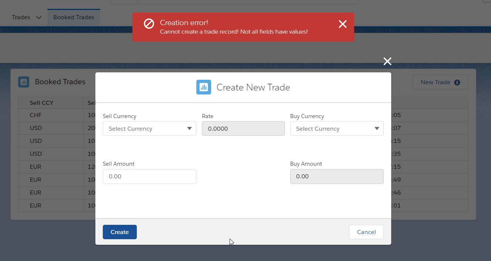

# Ebury technical test

> This application includes two views. The first one shows the list of Trades. The second one creates a new Trade according to requirements.

**REQ1**

- Custom SObject Trade__c is used for storing Trade records in the Salesforce database.

- The Trade list is sorted by "Date Booked" in descending order.

- The ID is unique and generated on creation with the following format: "TR" + 7 numbers.

- The schema: 

**REQ2**

- the "New Trade" button opens modal form to create a Trade.

- The "Buy Amount" is disabled for edit and automatically calculated by multiplying the "Sell Amount" by the 
"Rate".

- The currency rate is also disabled for edit and obtained remotely from Fixer.io.

- when the user selects a value in both "Sell Currency" and "Buy Currency", the app retrieve the latest
rate for the selected currency pair and display it, during this process a spinner is displayed.

- 

**REQ3** 

- When the trade recors creates successfully a tost message appears on the UI

- On opposite, when something went wrong during the creation process an error toast message appear on the screen

- When a new Trade record creates successfully the new chatter post is added to the queue "Trade
reviewers" in the following format:

Sell Currency: {sell ccy}
Sell Amount: {sell amount}
Buy Currency: {buy ccy}
Buy Amount: {buy amount}
Rate: {rate}
Booked Date: {date}

The direct link to Trade__c SObject is also included in the chatter post

**REQ4**

- The application uses Fixer.io to convert Sales Amount to Buy Amount.

- URL and token are stored in a respective Custom Metadata Types

**REQ5**

SFDX deployment guide

 Prerequisites:
 - Access to Salesforce DevHub org. 
 - Access to Fixer.io account.

 Steps:
1. Authorize your DevHub: `sfdx force:auth:web:login --setdefaultdevhubusername --setalias paulEburyDevHub`
2. Create new scratch org: `sfdx force:org:create -f config/project-scratch-def.json`
3. Push the source code: `sfdx force:source:deploy -p force-app`
4. Assign Ebury permission set to your user: `sfdx force:user:permset:assign --permsetname Ebury --targetusername YOUR_USERNAME`
5. Assign appropriate Users to "Trade reviewers" queue.
6. Create new fixer.io record in "End Point Pattern" and "Token" custom metadata types.

